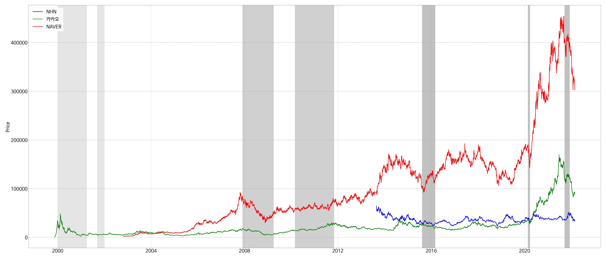
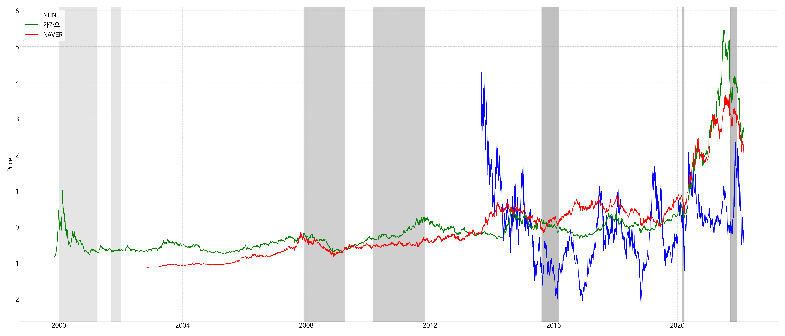
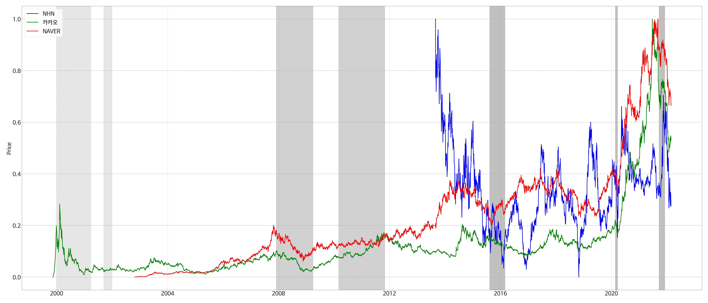
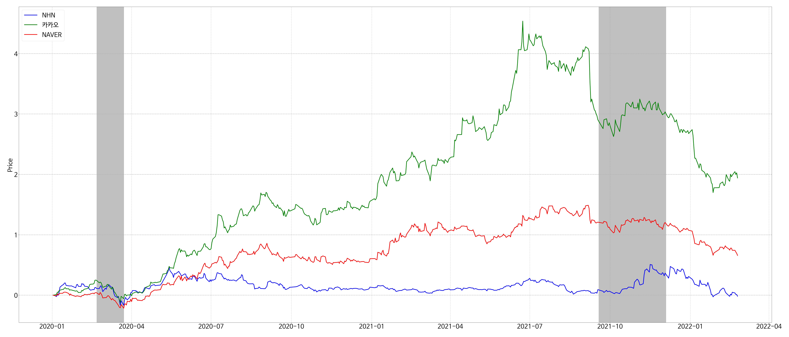
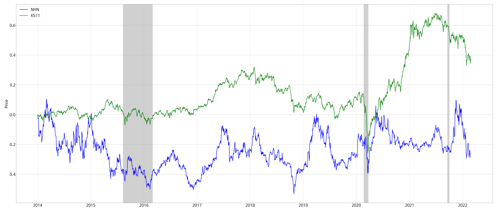
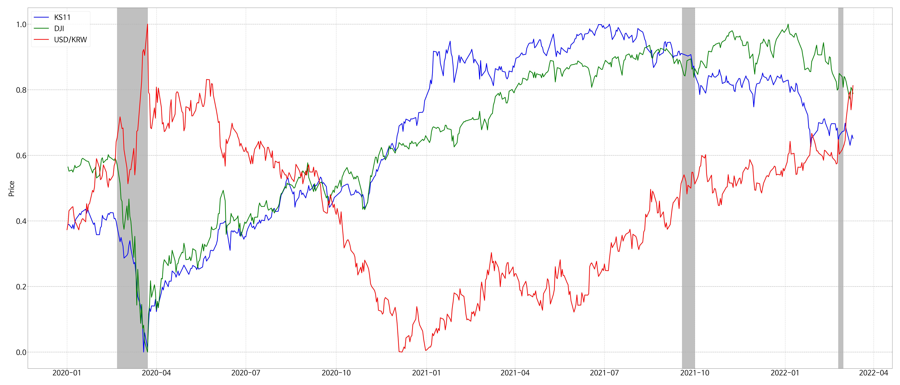
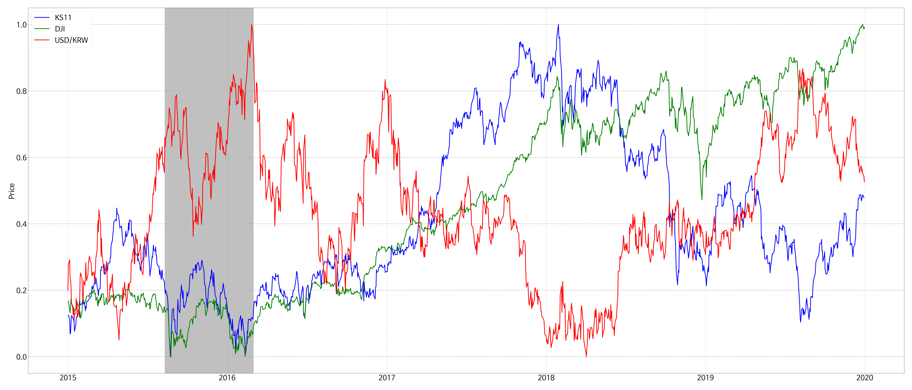
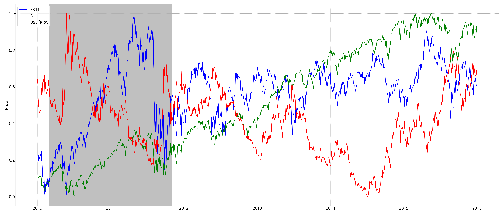

[](https://github.com/sanggi-wjg/stock_visualize/actions/workflows/lint_and_test.yml)


# Stock Visualize
특정 주식 종목(삼성전자, NHN) 이나 특정 인덱스(환율, 금, KOSPI, S&P500) 등에 대해서
그래프 차트를 그려줍니다.

## Graph chart samples
#### NHN, 카카오, 네이버 
주가 비교


<details>
<summary>정규화, 표준화, 수익률</summary>

정규화


표준화


수익률

</details>


<details>
한결같은 NHN ^^
<summary>수익률 - KOSPI, NHN (2014~) </summary>


</details>

<details>
<summary>정규화 - 환율, KOSPI, DowJones</summary>
환율과 KOSPI 지수는 반 상관관계 가짐   <br>
KOSPI 와 DowJones 는 상관관계를 가지나 외부요인으로 아닌 경우도 있음

2010~



</details>


## Development Environment
[](https://www.python.org/downloads/release/python-3102/)
[]()

```shell
Database 는 SQLAlchemy
Data 는 finance-datareader

이 외는 패키지는 아래 파일 참고
requriements.txt
```

## Usage
```shell
constants.py 에서 DATABASE 수정

1. command / register_markets  
    DB에 Market 등록 (Kospi, Kosdaq, ...)

2. command / register_stocks  
    DB에 Stock 등록 (삼성전자, NAVER ...)   

3. command / register_stock_prices
    DB에 StockPrice 등록

4. command / register_indexes
    DB에 Index 등록
    
5. command / register_index_prices
    DB에 IndexPrice 등록
    
4. command / craete_stock_chart
    Create graph chart
```


## Structure
```shell
app / commands / ...  : Executable service code
    / lib      / ...  : Library service code 
    / service  / ...  : Model service
    / database        : SqlAlchemy and Entities
    / exceptions      : Exceptions
    / utils           : Util code
    / vo              : Value Objects
    / constants       : Constants
    
.github / workflows / ... : workflow jobs 

docker / ... : Dockerfile or docker-compose file 

tests / ... : Test source code

(command line 으로 전체 다 테스트 해보고 싶다면
database engine 이 사용중인 db 말고 다른 db로 선택한 후에 
python -m unittest discover)
```
